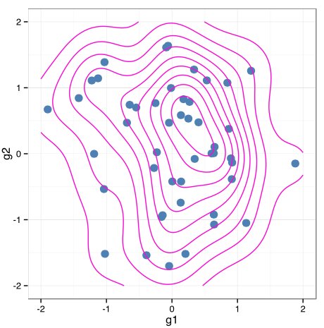

# gg4clj

R ggplot wrapper for Clojure, ported to PinkGorilla Notebook.

Essentially starts R in new process, issues R commands to it.
R library ggplot is used to render the plots as svg to a temporary file.
Temporary SVG file is rendered as hiccup marcup via Pinkie Rendering System (^:R)

An example, generating some random numbers in Clojure, and then plotting a 2D-density in ggplot:

```clojure
(defn b-m
  []
  (let [a (rand)
        b (rand)
        r (Math/sqrt (* -2 (Math/log a)))
        th (* 2 Math/PI b)]
    (* r (Math/cos th))))

(def g-dat {:g1 (repeatedly 50 b-m) :g2 (repeatedly 50 b-m)})

(gg4clj/view [[:<- :g (gg4clj/data-frame g-dat)]
              (gg4clj/r+
                [:ggplot :g [:aes :g1 :g2]]
                [:xlim -2 2]
                [:ylim -2 2]
                [:geom_point {:colour "steelblue" :size 4}]
                [:stat_density2d {:colour "#FF29D2"}]
                [:theme_bw])]
             {:width 5 :height 5})
```


